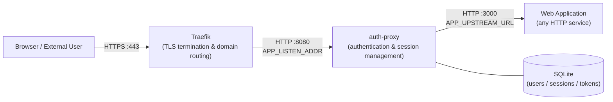
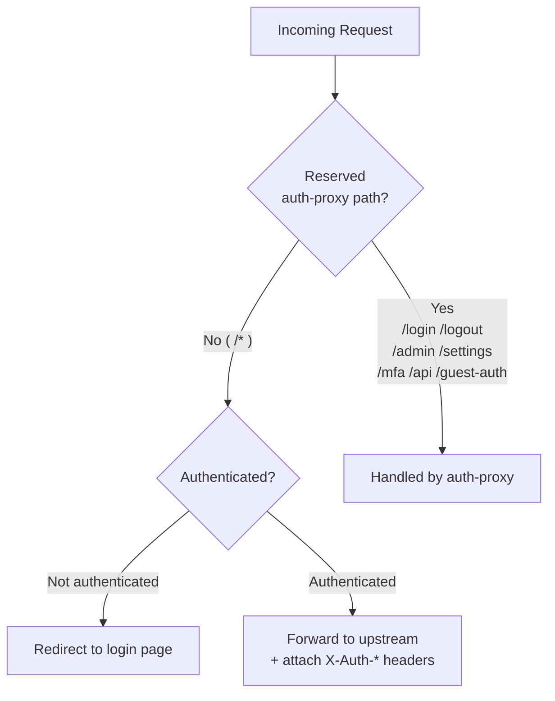

# auth-proxy

A single-binary authentication reverse proxy server. Place it behind Traefik or similar, and only requests that pass session authentication are forwarded to your upstream service. Upstream services never need to implement authentication themselves — they simply read `X-Auth-*` headers to identify the user.

## Table of Contents

- [Overview & Architecture](#overview--architecture)
- [Features](#features)
- [Security Design](#security-design)
- [Requirements](#requirements)
- [Building](#building)
- [Initial Setup](#initial-setup)
- [Environment Variable Reference](#environment-variable-reference)
- [CLI Reference](#cli-reference)
- [Headers Passed to Upstream](#headers-passed-to-upstream)
- [Guest Token Feature](#guest-token-feature)
- [Traefik Configuration](#traefik-configuration)
- [Operations](#operations)
- [Troubleshooting](#troubleshooting)
- [Project Structure](#project-structure)

---

## Overview & Architecture

### Port Layout



Each port is configured independently. `APP_LISTEN_ADDR` controls the port between Traefik and auth-proxy; `APP_UPSTREAM_URL` controls the port between auth-proxy and your web application.

### Path Routing



Traefik routes all traffic for a domain to auth-proxy. Requests to `/*` are forwarded to the upstream service after authentication. Design your upstream application to avoid auth-proxy's reserved paths.

### Design Principles

- **Authentication only**: TLS termination and URL routing are delegated to Traefik; auth-proxy handles authentication exclusively
- **Single binary**: Embeds SQLite with zero external dependencies
- **Zero auth burden on upstream**: User identity is passed via HTTP headers, so upstream services need no authentication logic whatsoever
- **No restarts required**: User and configuration changes take effect immediately; sessions persist across restarts
- **Non-blocking**: All requests are handled concurrently

---

## Features

| Phase | Feature | Status |
|---|---|---|
| Phase 1 | Reverse proxy core, SQLite session persistence, hot reload | ✅ Implemented |
| Phase 2 | Web admin panel (list, create, edit, delete users) | ✅ Implemented |
| Phase 3a | MFA (TOTP + backup codes + device remembering) | ✅ Implemented |
| Phase 3a-2 | Admin-forced MFA disable, user security settings page, self-service password change, backup code regeneration | ✅ Implemented |
| Phase 4 | Guest token feature (use limits, password protection, shared links with UI metadata) | ✅ Implemented |
| Phase 3b | Passkeys (WebAuthn) | 🔜 Planned |

---

## Security Design

### Cookie Attributes

```
Set-Cookie: session_id=<token>; HttpOnly; Secure; SameSite=Strict; Max-Age=<TTL seconds>
```

All four attributes are required.

| Attribute | Purpose |
|---|---|
| `HttpOnly` | Blocks JavaScript access to cookies → prevents session theft via XSS |
| `Secure` | Transmitted over HTTPS only → prevents leakage over plaintext connections |
| `SameSite=Strict` | Cookie not sent on cross-site requests → CSRF protection |
| `Max-Age` | Default 8 hours; configurable via `APP_SESSION_TTL_HOURS` |

### Password Protection

Passwords are hashed with **Argon2id** and stored in SQLite. Plaintext passwords are never stored or logged. Login failures introduce an intentional 500ms delay to deter brute-force attacks. Dummy Argon2 verification is always performed even for non-existent usernames, preventing user enumeration via timing differences.

### X-Auth-* Header Spoofing Prevention

Any headers beginning with `X-Auth-` that arrive from the client are stripped before forwarding. After session verification, the correct values are attached by auth-proxy, so upstream services can trust these headers unconditionally.

### MFA (TOTP)

Implements RFC 6238 compliant TOTP. Includes 8 backup codes for account recovery, trusted device remembering (30 days), and brute-force protection via attempt rate limiting.

---

## Requirements

- Rust 1.75 or later
- Linux (Ubuntu 22.04 LTS or later recommended)
- Traefik running on the same host or as a reverse proxy
- systemd (for service management)

---

## Building

auth-proxy has no architecture-specific dependencies. Choose the target that matches your deployment environment.

### Build directly on Linux (on the deployment server)

```bash
cargo build --release
# → target/release/auth-proxy
```

### Cross-compile (from a Mac or other dev machine targeting Linux)

Using `cross` generates a fully static binary (musl) via Docker.

```bash
cargo install cross --git https://github.com/cross-rs/cross

# For Intel / AMD Linux (x86_64)
cross build --release --target x86_64-unknown-linux-musl
# → target/x86_64-unknown-linux-musl/release/auth-proxy

# For ARM Linux (AWS Graviton, etc.)
cross build --release --target aarch64-unknown-linux-musl
# → target/aarch64-unknown-linux-musl/release/auth-proxy
```

On AWS EC2, Graviton (ARM) instances currently offer better cost-performance. Choose the target that matches your instance type.

---

## Initial Setup

```bash
# 1. Place the binary
# Cross-compiled: target/<target>/release/auth-proxy
# Built on Linux: target/release/auth-proxy
sudo cp <path-to-built-binary>/auth-proxy /usr/local/bin/
sudo chmod +x /usr/local/bin/auth-proxy

# 2. Create directories and config file
sudo mkdir -p /etc/auth-proxy /var/lib/auth-proxy
sudo cp .env.example /etc/auth-proxy/.env
sudo chmod 600 /etc/auth-proxy/.env

# 3. Edit .env (see Environment Variable Reference below)
sudo vim /etc/auth-proxy/.env

# 4. Create the initial admin user
sudo auth-proxy init-admin

# 5. Register and start the systemd service
sudo cp systemd/auth-proxy.service /etc/systemd/system/
sudo systemctl daemon-reload
sudo systemctl enable auth-proxy
sudo systemctl start auth-proxy

# 6. Confirm startup
sudo systemctl status auth-proxy
```

---

## Environment Variable Reference

Place these in `/etc/auth-proxy/.env`. Use `.env.example` as a template.

| Variable | Required | Default | Description |
|---|---|---|---|
| `APP_UPSTREAM_URL` | ✅ | — | Upstream service URL (e.g. `http://127.0.0.1:3000`) |
| `APP_DB_PATH` | ✅ | — | SQLite database file path (e.g. `/var/lib/auth-proxy/auth-proxy.db`) |
| `APP_LISTEN_ADDR` | — | `127.0.0.1:8080` | Address and port for the server to listen on |
| `APP_SESSION_TTL_HOURS` | — | `8` | Session lifetime in hours |
| `APP_ISSUER_NAME` | — | `auth-proxy` | Value for the `X-Auth-Issuer` header; useful when running multiple proxy instances |
| `APP_MFA_ENCRYPTION_KEY` | ✅ | — | Encryption key for TOTP secrets. Generate with `openssl rand -hex 32` |
| `APP_GUEST_TOKEN_SECRET` | ✅ | — | Signing key for guest tokens. Generate with `openssl rand -hex 32` |
| `APP_GUEST_TOKEN_API_KEY` | ✅ | — | API authentication key for guest token issuance. Generate with `openssl rand -hex 32` |
| `RUST_LOG` | — | `info` | Log level (`trace` / `debug` / `info` / `warn` / `error`) |

### Example .env

```dotenv
APP_UPSTREAM_URL=http://127.0.0.1:3000
APP_DB_PATH=/var/lib/auth-proxy/auth-proxy.db
APP_LISTEN_ADDR=127.0.0.1:8080
APP_SESSION_TTL_HOURS=8
APP_ISSUER_NAME=my-service
APP_MFA_ENCRYPTION_KEY=paste output of: openssl rand -hex 32
APP_GUEST_TOKEN_SECRET=paste output of: openssl rand -hex 32
APP_GUEST_TOKEN_API_KEY=paste output of: openssl rand -hex 32
RUST_LOG=info
```

---

## CLI Reference

```
auth-proxy serve           Start the server (default when no subcommand is given)
auth-proxy init-admin      Interactively create the initial admin user
auth-proxy hash            Interactively generate an Argon2id hash for a password
auth-proxy verify <user>   Interactively verify a user's password (for debugging)
auth-proxy list            List all registered users
```

---

## Headers Passed to Upstream

When forwarding an authenticated request, auth-proxy attaches the following headers. Upstream services can identify users simply by reading them.

| Header | Content | Example |
|---|---|---|
| `X-Auth-User` | Username | `alice` |
| `X-Auth-User-Id` | Numeric user ID (stable identifier; equivalent to OIDC `sub`) | `42` |
| `X-Auth-Role` | Role | `admin` or `user` |
| `X-Auth-Issuer` | Proxy identifier (value of `APP_ISSUER_NAME`) | `auth-proxy` |
| `X-Auth-Guest` | `true` for guest token access only; not present for normal sessions | `true` |

Because usernames may change over time, upstream services should use `X-Auth-User-Id` as the stable primary key for persistent user identification.

### Implementation Examples

```python
# Python (Flask)
@app.route("/")
def index():
    user_id  = request.headers.get("X-Auth-User-Id")   # "42"
    username = request.headers.get("X-Auth-User")       # "alice"
    role     = request.headers.get("X-Auth-Role")       # "user" | "admin"
    # No authentication logic needed — just read the headers
```

```go
// Go
func handler(w http.ResponseWriter, r *http.Request) {
    userID   := r.Header.Get("X-Auth-User-Id")   // "42"
    username := r.Header.Get("X-Auth-User")       // "alice"
    role     := r.Header.Get("X-Auth-Role")       // "user" | "admin"
}
```

---

## Guest Token Feature

Provides unauthenticated limited-access sharing managed within the same authentication context. Upstream services simply tell auth-proxy which path to expose — token generation, verification, and expiry management are all handled by auth-proxy.

### Issuing a Token

```bash
curl -X POST https://your-domain/api/guest-token \
  -H "Authorization: Bearer <APP_GUEST_TOKEN_API_KEY>" \
  -H "Content-Type: application/json" \
  -d '{
    "path": "/shared/report",
    "expires_in": 86400,
    "max_uses": 10,
    "password": "secret123",
    "ui": {
      "title": "Q3 Report",
      "description": "Enter the password from your invitation email"
    }
  }'
```

| Parameter | Required | Description |
|---|---|---|
| `path` | ✅ | Path prefix to allow access to (must start with `/`) |
| `expires_in` | ✅ | Expiry duration in seconds |
| `max_uses` | — | Maximum number of accesses; unlimited if omitted |
| `password` | — | Password to require; if omitted, the URL grants direct access |
| `ui.title` | — | Title shown on the password entry form |
| `ui.description` | — | Description shown on the password entry form |

### End-User Access

```
https://your-domain/shared/report?guest_token=<token>
```

If a password is set, a form is displayed. Once the correct password is entered, a `guest_session_id` cookie is issued and subsequent requests no longer require the token in the URL.

---

## Traefik Configuration

```yaml
# /etc/traefik/dynamic/auth-proxy.yml
http:
  routers:
    my-service:
      rule: "Host(`tool.internal.example.com`)"
      entryPoints:
        - websecure
      tls: {}
      service: auth-proxy

  services:
    auth-proxy:
      loadBalancer:
        servers:
          - url: "http://127.0.0.1:8080"
```

Ensure that the port in `APP_LISTEN_ADDR` matches the `url` in the Traefik configuration. Because session cookies require the `Secure` attribute, TLS must be enabled in Traefik — cookies will not be sent over plain HTTP.

---

## Operations

### User Management

Adding, editing, and deleting users is best done through the admin panel at `/admin/users`. CLI operations are also available.

```bash
# Open in browser
https://your-domain/admin/users

# List users via CLI
auth-proxy list

# Test a user's password
auth-proxy verify alice
```

### Viewing Logs

```bash
# Follow logs in real time
sudo journalctl -u auth-proxy -f

# Show last 100 lines
sudo journalctl -u auth-proxy -n 100

# Show errors only
sudo journalctl -u auth-proxy -p err
```

### Service Commands

```bash
sudo systemctl status auth-proxy
sudo systemctl restart auth-proxy
sudo systemctl stop auth-proxy
sudo systemctl start auth-proxy
```

---

## Troubleshooting

### Service fails to start

```bash
sudo journalctl -u auth-proxy -n 50
```

| Error | Cause | Fix |
|---|---|---|
| `APP_UPSTREAM_URL is not set` | Missing environment variable | Check `.env` and set all required variables |
| `APP_DB_PATH is not set` | Missing environment variable | Check `.env` and set all required variables |
| `Address already in use` | Port already occupied | Change `APP_LISTEN_ADDR` or stop the conflicting process |
| DB permission error | No write permission on DB file | Set the owner of `/var/lib/auth-proxy` to the service's runtime user |

### Cannot log in

```bash
auth-proxy verify <username>
auth-proxy list
```

### Cannot reach upstream service

Verify that your upstream service is running at the URL specified in `APP_UPSTREAM_URL`. auth-proxy is designed to forward to a service on the same host; proxying to external URLs is not supported.

---

## Project Structure

```
auth-proxy/
├── Cargo.toml
├── Cargo.lock
├── .env.example
├── .gitignore
├── README.md
├── README.en.md
├── migrations/                    # SQLite migration files
├── systemd/
│   └── auth-proxy.service
└── src/
    ├── main.rs                    # Entry point & CLI dispatch
    ├── config.rs                  # Environment variable loading and validation
    ├── users.rs                   # UserStore (Argon2id, RwLock cache)
    ├── session.rs                 # SessionStore (SQLite persistence)
    ├── mfa.rs                     # MfaStore (TOTP, backup codes, device remembering)
    ├── guest_token.rs             # GuestTokenStore
    ├── handlers/
    │   ├── login.rs               # GET/POST /login
    │   ├── logout.rs              # GET /logout
    │   ├── proxy.rs               # ALL /* (upstream forwarding, X-Auth-* header injection)
    │   ├── mfa.rs                 # MFA verification flow
    │   ├── guest_token.rs         # POST /api/guest-token
    │   ├── guest_auth.rs          # GET/POST /guest-auth
    │   ├── settings/
    │   │   ├── mod.rs
    │   │   └── security.rs        # GET/POST /settings/security/*
    │   └── admin/
    │       ├── mod.rs
    │       ├── dashboard.rs       # GET /admin/
    │       └── users.rs           # GET/POST /admin/users/*
    ├── middleware/
    │   ├── auth.rs                # Session verification & X-Auth-* spoofing prevention
    │   └── admin.rs               # Admin role enforcement
    └── cli/
        ├── hash.rs
        ├── verify.rs
        ├── list.rs
        └── init_admin.rs
```

---

## License

MIT
