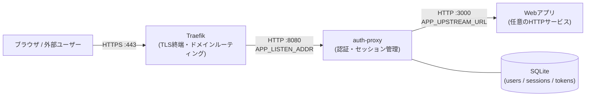
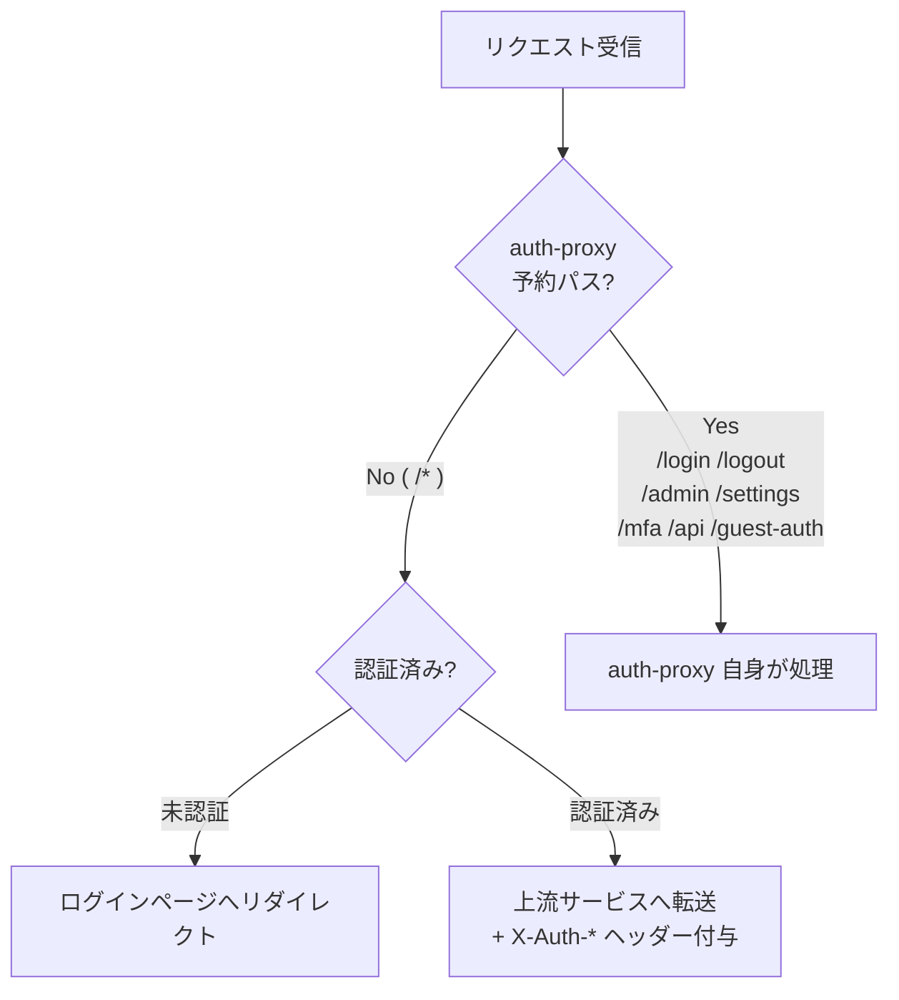

# auth-proxy

認証特化型のシングルバイナリ・リバースプロキシサーバーです。Traefik等の背後に配置し、セッション認証を通過したリクエストのみ上流サービスに転送します。上流サービスは認証処理を一切実装する必要がなく、`X-Auth-*` ヘッダーを参照するだけでユーザーを識別できます。

## 目次

- [概要とアーキテクチャ](#概要とアーキテクチャ)
- [機能一覧](#機能一覧)
- [セキュリティ設計](#セキュリティ設計)
- [必要環境](#必要環境)
- [ビルド](#ビルド)
- [初回セットアップ](#初回セットアップ)
- [環境変数リファレンス](#環境変数リファレンス)
- [CLIコマンドリファレンス](#cliコマンドリファレンス)
- [上流サービスへのヘッダー伝達](#上流サービスへのヘッダー伝達)
- [ゲストトークン機能](#ゲストトークン機能)
- [Traefik連携設定](#traefik連携設定)
- [運用手順](#運用手順)
- [トラブルシューティング](#トラブルシューティング)
- [プロジェクト構成](#プロジェクト構成)

---

## 概要とアーキテクチャ

### ポート構成



各コンポーネント間のポートはそれぞれ独立して設定できます。`APP_LISTEN_ADDR` が Traefik → auth-proxy 間のポートを、`APP_UPSTREAM_URL` が auth-proxy → Webアプリ間のポートを決定します。

### パスルーティング



Traefik はドメイン単位でトラフィックをauth-proxyに向けます。`/*` へのリクエストは認証検証後に上流サービスへそのまま転送されます。上流サービスはauth-proxyの予約パスを使用しないよう設計してください。

### 設計思想

- **認証に特化**: TLS終端・URLルーティングはTraefikに委譲し、認証のみを担う
- **シングルバイナリ**: SQLiteを内蔵し、追加インフラ不要で動作
- **上流サービスの認証負担ゼロ**: ユーザー情報をHTTPヘッダーで渡すことで、上流サービスは認証処理を一切実装しなくてよい
- **再起動不要**: ユーザー変更・設定変更は即時反映。セッションは再起動後も維持
- **ノンブロッキング**: すべてのリクエストは並列処理される

---

## 機能一覧

| フェーズ | 機能 | 状態 |
|---|---|---|
| Phase 1 | リバースプロキシ基盤・セッション永続化 (SQLite)・ホットリロード | ✅ 実装済み |
| Phase 2 | Web管理画面 (ユーザー一覧・追加・編集・削除) | ✅ 実装済み |
| Phase 3a | MFA (TOTP + バックアップコード + デバイス記憶) | ✅ 実装済み |
| Phase 3a-2 | 管理者によるMFA強制無効化・ユーザー向けセキュリティ設定ページ・自己パスワード変更・バックアップコード再発行 | ✅ 実装済み |
| Phase 4 | ゲストトークン機能 (回数制限・パスワード保護・UIメタ情報付き共有リンク) | ✅ 実装済み |
| Phase 3b | パスキー (WebAuthn) | 🔜 将来フェーズ |

---

## セキュリティ設計

### Cookie属性

```
Set-Cookie: session_id=<token>; HttpOnly; Secure; SameSite=Strict; Max-Age=<TTL秒>
```

4属性すべて必須です。

| 属性 | 目的 |
|---|---|
| `HttpOnly` | JavaScriptからのCookieアクセスを遮断 → XSS経由のセッション窃取防止 |
| `Secure` | HTTPS経由でのみ送信 → 平文通信での漏洩防止 |
| `SameSite=Strict` | クロスサイトリクエストでCookieを送信しない → CSRF防止 |
| `Max-Age` | デフォルト8時間。`APP_SESSION_TTL_HOURS` で変更可能 |

### パスワード保護

パスワードは **Argon2id** でハッシュ化してSQLiteに保存します。平文は一切保存・ログ出力しません。ログイン失敗時は意図的に500ms遅延させてブルートフォース攻撃を抑止し、存在しないユーザー名でもダミーのArgon2検証を実行してユーザー名列挙攻撃を防ぎます。

### X-Auth-* ヘッダーの偽装防止

クライアントから `X-Auth-` で始まるヘッダーが送られてきた場合、上流転送前に必ず除去します。セッション検証後に正しい値を付与して転送するため、上流サービスは受け取ったヘッダーを無条件に信頼できます。

### MFA (TOTP)

RFC 6238 準拠のTOTPに対応しています。バックアップコード（8本）による復旧、信頼済みデバイスの記憶（30日間）、ブルートフォース対策（試行回数制限）を実装しています。

---

## 必要環境

- Rust 1.75 以上
- Linux (Ubuntu 22.04 LTS 以降推奨)
- Traefik が同一ホストまたはリバースプロキシとして動作していること
- systemd (サービス管理用)

---

## ビルド

auth-proxy はアーキテクチャに依存しません。デプロイ先のCPUに合わせてターゲットを選んでください。

### Linux上で直接ビルド（デプロイ先サーバー上で実行する場合）

```bash
cargo build --release
# → target/release/auth-proxy
```

### クロスコンパイル（Mac等の開発マシンからLinuxサーバー向けにビルドする場合）

`cross` を使うと、Dockerを経由してターゲット向けの完全静的バイナリ（musl）が生成されます。

```bash
cargo install cross --git https://github.com/cross-rs/cross

# Intel / AMD 系 Linux (x86_64) 向け
cross build --release --target x86_64-unknown-linux-musl
# → target/x86_64-unknown-linux-musl/release/auth-proxy

# ARM 系 Linux (AWS Graviton 等) 向け
cross build --release --target aarch64-unknown-linux-musl
# → target/aarch64-unknown-linux-musl/release/auth-proxy
```

AWS EC2 では現在、Graviton（ARM）インスタンスがコストパフォーマンスに優れています。デプロイ先のインスタンスタイプに合わせてターゲットを選択してください。

---

## 初回セットアップ

```bash
# 1. バイナリを配置
# クロスコンパイルした場合は target/<ターゲット>/release/auth-proxy
# Linux上で直接ビルドした場合は target/release/auth-proxy
sudo cp <ビルド成果物のパス>/auth-proxy /usr/local/bin/
sudo chmod +x /usr/local/bin/auth-proxy

# 2. ディレクトリとファイルを作成
sudo mkdir -p /etc/auth-proxy /var/lib/auth-proxy
sudo cp .env.example /etc/auth-proxy/.env
sudo chmod 600 /etc/auth-proxy/.env

# 3. .env を編集 (下記「環境変数リファレンス」参照)
sudo vim /etc/auth-proxy/.env

# 4. 初期管理者ユーザーを作成
sudo auth-proxy init-admin

# 5. systemd サービスを登録・起動
sudo cp systemd/auth-proxy.service /etc/systemd/system/
sudo systemctl daemon-reload
sudo systemctl enable auth-proxy
sudo systemctl start auth-proxy

# 6. 起動確認
sudo systemctl status auth-proxy
```

---

## 環境変数リファレンス

`/etc/auth-proxy/.env` に記述します。`.env.example` をテンプレートとして使用してください。

| 変数名 | 必須 | デフォルト | 説明 |
|---|---|---|---|
| `APP_UPSTREAM_URL` | ✅ | — | 上流サービスのURL (例: `http://127.0.0.1:3000`) |
| `APP_DB_PATH` | ✅ | — | SQLiteデータベースファイルのパス (例: `/var/lib/auth-proxy/auth-proxy.db`) |
| `APP_LISTEN_ADDR` | — | `127.0.0.1:8080` | サーバーがListenするアドレスとポート |
| `APP_SESSION_TTL_HOURS` | — | `8` | セッション有効期限（時間単位） |
| `APP_ISSUER_NAME` | — | `auth-proxy` | `X-Auth-Issuer` ヘッダーの値。複数プロキシを識別する場合に使用 |
| `APP_MFA_ENCRYPTION_KEY` | ✅ | — | TOTPシークレット暗号化キー。`openssl rand -hex 32` で生成 |
| `APP_GUEST_TOKEN_SECRET` | ✅ | — | ゲストトークン署名キー。`openssl rand -hex 32` で生成 |
| `APP_GUEST_TOKEN_API_KEY` | ✅ | — | ゲストトークン発行API認証キー。`openssl rand -hex 32` で生成 |
| `RUST_LOG` | — | `info` | ログレベル (`trace` / `debug` / `info` / `warn` / `error`) |

### .env 記述例

```dotenv
APP_UPSTREAM_URL=http://127.0.0.1:3000
APP_DB_PATH=/var/lib/auth-proxy/auth-proxy.db
APP_LISTEN_ADDR=127.0.0.1:8080
APP_SESSION_TTL_HOURS=8
APP_ISSUER_NAME=my-service
APP_MFA_ENCRYPTION_KEY=ここに openssl rand -hex 32 の出力を貼り付ける
APP_GUEST_TOKEN_SECRET=ここに openssl rand -hex 32 の出力を貼り付ける
APP_GUEST_TOKEN_API_KEY=ここに openssl rand -hex 32 の出力を貼り付ける
RUST_LOG=info
```

---

## CLIコマンドリファレンス

```
auth-proxy serve           サーバーを起動する（引数なし時のデフォルト動作）
auth-proxy init-admin      初期管理者ユーザーを対話的に作成する
auth-proxy hash            パスワードのArgon2idハッシュを対話的に生成する
auth-proxy verify <user>   指定ユーザーのパスワードを対話的に検証する（デバッグ用）
auth-proxy list            登録されているユーザー一覧を表示する
```

---

## 上流サービスへのヘッダー伝達

認証済みリクエストを上流に転送する際、以下のヘッダーを付与します。上流サービスはこれらを参照するだけでユーザーを識別できます。

| ヘッダー名 | 内容 | 例 |
|---|---|---|
| `X-Auth-User` | ユーザー名 | `alice` |
| `X-Auth-User-Id` | ユーザーの数値ID（永続的な識別子。OIDCの `sub` 相当） | `42` |
| `X-Auth-Role` | ロール | `admin` または `user` |
| `X-Auth-Issuer` | このプロキシの識別名（`APP_ISSUER_NAME` の値） | `auth-proxy` |
| `X-Auth-Guest` | ゲストアクセス時のみ `true`。通常認証時は付与しない | `true` |

ユーザー名は将来変更される可能性があるため、上流サービスがユーザーを永続的に識別する場合は `X-Auth-User-Id` を主キーとして扱うことを推奨します。

### 実装例

```python
# Python (Flask)
@app.route("/")
def index():
    user_id  = request.headers.get("X-Auth-User-Id")   # "42"
    username = request.headers.get("X-Auth-User")       # "alice"
    role     = request.headers.get("X-Auth-Role")       # "user" | "admin"
    # 認証処理は不要。ヘッダーを参照するだけでよい
```

```go
// Go
func handler(w http.ResponseWriter, r *http.Request) {
    userID   := r.Header.Get("X-Auth-User-Id")   // "42"
    username := r.Header.Get("X-Auth-User")       // "alice"
    role     := r.Header.Get("X-Auth-Role")       // "user" | "admin"
}
```

---

## ゲストトークン機能

ログイン不要の限定公開アクセスを認証の文脈で一元管理します。上流サービスが「どのパスを公開したいか」をauth-proxyに委託するだけで、トークンの生成・検証・失効管理はすべてauth-proxyが担います。

### トークン発行

```bash
curl -X POST https://your-domain/api/guest-token \
  -H "Authorization: Bearer <APP_GUEST_TOKEN_API_KEY>" \
  -H "Content-Type: application/json" \
  -d '{
    "path": "/shared/report",
    "expires_in": 86400,
    "max_uses": 10,
    "password": "secret123",
    "ui": {
      "title": "Q3レポート",
      "description": "招待メールのパスワードを入力してください"
    }
  }'
```

| パラメータ | 必須 | 説明 |
|---|---|---|
| `path` | ✅ | アクセスを許可するパスのプレフィックス（`/` 始まり） |
| `expires_in` | ✅ | 有効期限（秒単位） |
| `max_uses` | — | 最大アクセス回数。省略時は無制限 |
| `password` | — | 入力を求めるパスワード。省略時はURL直アクセスで通過 |
| `ui.title` | — | パスワード入力画面のタイトル |
| `ui.description` | — | パスワード入力画面の説明文 |

### エンドユーザーのアクセス方法

```
https://your-domain/shared/report?guest_token=<token>
```

パスワードありの場合は入力フォームが表示され、正しいパスワードを入力すると `guest_session_id` Cookieが発行されます。以降はURLにトークンがなくてもアクセスできます。

---

## Traefik連携設定

```yaml
# /etc/traefik/dynamic/auth-proxy.yml
http:
  routers:
    my-service:
      rule: "Host(`tool.internal.example.com`)"
      entryPoints:
        - websecure
      tls: {}
      service: auth-proxy

  services:
    auth-proxy:
      loadBalancer:
        servers:
          - url: "http://127.0.0.1:8080"
```

`APP_LISTEN_ADDR` と Traefik の `url` のポートが一致していることを確認してください。CookieのSecure属性はHTTPS通信を前提としているため、TraefikでTLSを有効にしていない環境ではCookieが送信されません。

---

## 運用手順

### ユーザー管理

ユーザーの追加・編集・削除は管理画面（`/admin/users`）から行うことを推奨します。CLIからも操作可能です。

```bash
# 管理画面
# ブラウザで https://your-domain/admin/users を開く

# CLIでユーザー一覧確認
auth-proxy list

# ユーザーのパスワード検証テスト
auth-proxy verify alice
```

### ログ確認

```bash
# リアルタイムでログを追う
sudo journalctl -u auth-proxy -f

# 直近100行を確認
sudo journalctl -u auth-proxy -n 100

# エラーのみ抽出
sudo journalctl -u auth-proxy -p err
```

### サービス操作

```bash
sudo systemctl status auth-proxy
sudo systemctl restart auth-proxy
sudo systemctl stop auth-proxy
sudo systemctl start auth-proxy
```

---

## トラブルシューティング

### サービスが起動しない

```bash
sudo journalctl -u auth-proxy -n 50
```

| エラー内容 | 原因 | 対処 |
|---|---|---|
| `APP_UPSTREAM_URL is not set` | 環境変数が未設定 | `.env` を確認し必須項目を設定 |
| `APP_DB_PATH is not set` | 環境変数が未設定 | `.env` を確認し必須項目を設定 |
| `Address already in use` | ポートが使用中 | `APP_LISTEN_ADDR` を変更するか競合プロセスを停止 |
| DB permission error | DBファイルへの書き込み権限なし | `/var/lib/auth-proxy` のオーナーを実行ユーザーに設定 |

### ログインできない

```bash
auth-proxy verify <username>
auth-proxy list
```

### 上流サービスに接続できない

`APP_UPSTREAM_URL` に設定したURLに上流サービスが起動しているか確認してください。auth-proxyと上流サービスは同一ホスト上で動作することを前提としており、外部URLへのプロキシは想定していません。

---

## プロジェクト構成

```
auth-proxy/
├── Cargo.toml
├── Cargo.lock
├── .env.example
├── .gitignore
├── README.md
├── migrations/                    # SQLiteマイグレーションファイル
├── systemd/
│   └── auth-proxy.service
└── src/
    ├── main.rs                    # エントリーポイント・CLIディスパッチ
    ├── config.rs                  # 環境変数読み込みと検証
    ├── users.rs                   # UserStore (Argon2id・RwLockキャッシュ)
    ├── session.rs                 # SessionStore (SQLite永続化)
    ├── mfa.rs                     # MfaStore (TOTP・バックアップコード・デバイス記憶)
    ├── guest_token.rs             # GuestTokenStore
    ├── handlers/
    │   ├── login.rs               # GET/POST /login
    │   ├── logout.rs              # GET /logout
    │   ├── proxy.rs               # ALL /* (上流転送・X-Auth-*ヘッダー付与)
    │   ├── mfa.rs                 # MFA検証フロー
    │   ├── guest_token.rs         # POST /api/guest-token
    │   ├── guest_auth.rs          # GET/POST /guest-auth
    │   ├── settings/
    │   │   ├── mod.rs
    │   │   └── security.rs        # GET/POST /settings/security/*
    │   └── admin/
    │       ├── mod.rs
    │       ├── dashboard.rs       # GET /admin/
    │       └── users.rs           # GET/POST /admin/users/*
    ├── middleware/
    │   ├── auth.rs                # セッション検証・X-Auth-*偽装除去
    │   └── admin.rs               # 管理者ロール検証
    └── cli/
        ├── hash.rs
        ├── verify.rs
        ├── list.rs
        └── init_admin.rs
```

---

## ライセンス

MIT
