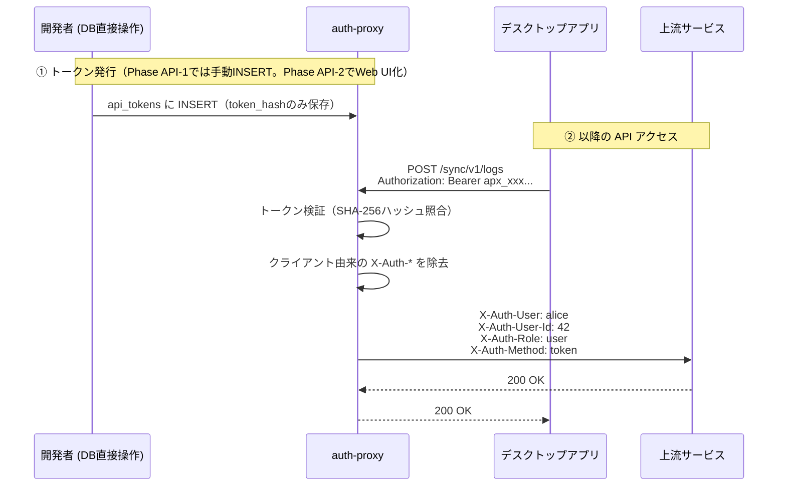

# auth-proxy — 実装仕様書 v11

## 概要

既存のWebアプリやファイルに**認証を後付けする**ための、認証特化型プロキシサーバー。

auth-proxyがすべての認証処理を担い、認証済みリクエストのみ上流に転送する。動作モードは2つあり、用途に応じて使い分ける。

ゲストトークン機能により、ログイン不要の限定公開アクセス（共有リンク等）も認証の文脈で一元管理できる。上流サービスは「誰が来たか」をヘッダーで受け取るだけでよく、認証・ゲスト管理のロジックを一切持たなくてよい。

### 動作モード

| モード | 環境変数 | 用途 | 推奨デプロイ形態 |
|---|---|---|---|
| **静的ファイルモード** | `AUTH_PROXY_SERVE_PATH` のみ設定 | 社内ドキュメント・写真・静的サイト等の認証付き公開 | シングルバイナリ |
| **プロキシモード** | `AUTH_PROXY_UPSTREAM_APP_URL` のみ設定 | 既存Webアプリへの認証後付け | Docker Compose |
| **併用モード** | 両方設定 | 静的ファイルと上流アプリを同時に扱う | Docker Compose |

`AUTH_PROXY_SERVE_PATH` と `AUTH_PROXY_UPSTREAM_APP_URL` はいずれか一方、または両方を設定できる。両方未設定の場合は起動時エラー。

### 設計思想

- **後付け認証**: コード変更不要。設定を追加するだけで認証がつく
- **モード選択の自由**: 静的ファイルならシングルバイナリで完結。動的アプリならDockerで隔離
- **認証に特化**: TLS終端・高度なルーティングはTraefik等のリバースプロキシに委譲し、認証のみを担う
- **単一バイナリ**: SQLiteを内蔵し外部DBへの依存なし。Dockerイメージも極小
- **ノンブロッキング**: どのリクエストも他をブロックしない並列設計
- **再起動不要**: ユーザー変更・設定変更は即時反映。セッションは再起動後も維持
- **非力なハードウェアでも動作**: メモリフットプリントを最小化
- **上流サービスの認証負担ゼロ**: 認証済みユーザー情報をHTTPヘッダーで渡すことで、上流サービスはユーザー認証を一切気にせず処理に集中できる
- **エンドユーザーの安定導線**: `/me` を公開URLとして固定し、上流アプリは内部実装URLを知らずにアカウント設定へのリンクを張れる（Phase Me）
- **ブラウザ以外のクライアントへの対応**: `Authorization: Bearer` によるAPIトークン認証を追加し、Cookieを扱えないネイティブアプリ・CLI・CI等からのアクセスも、上流サービスに認証実装を持たせずに実現する（Phase API）

### oauth2-proxy との比較

| | auth-proxy | oauth2-proxy |
|---|---|---|
| ユーザー管理 | 自前SQLite（管理画面付き） | Google / GitHub等の外部IdPに依存 |
| セットアップ | バイナリ配置またはComposeに追加するだけ | OAuthアプリ登録・IdP設定が必要 |
| 静的ファイル配信 | ✅ 内蔵 | ❌ |
| MFA | ✅ TOTP（内蔵） | IdP依存 |
| 外部サービス不要 | ✅ | ❌ |
| イメージサイズ | 極小（静的バイナリ） | 中程度 |

---

## デプロイメント

### モード①: 静的ファイルモード（シングルバイナリ）

社内ドキュメントや写真ギャラリーなど、**静的ファイルに認証をつけたい**場合に使用する。上流サービスが存在しないため、ネットワーク隔離の問題は発生しない。バイナリ1つとSQLiteファイルだけで完結する。

```
[ブラウザ / 外部ユーザー]
    |
    | HTTPS
    v
[Traefik / nginx 等]  ← TLS終端・ドメインルーティング
    |
    | HTTP (内部 127.0.0.1)
    v
[auth-proxy バイナリ]  ← systemd等で直接起動
    |
    |-- GET/POST /login      認証処理
    |-- GET      /logout     セッション削除
    |-- GET/POST /admin/*    管理画面
    |-- ALL      /*          認証検証 → AUTH_PROXY_SERVE_PATH からファイルを返す
    |
    +-- SQLite (sessions, users)
    +-- AUTH_PROXY_SERVE_PATH=/var/www/html
```

**環境変数（静的ファイルモード）**:

```dotenv
AUTH_PROXY_SERVE_PATH=/var/www/html   # 必須。公開するディレクトリのパス
AUTH_PROXY_DB_PATH=/var/lib/auth-proxy/auth-proxy.db
AUTH_PROXY_LISTEN_ADDR=127.0.0.1:8080
AUTH_PROXY_SESSION_TTL_HOURS=8
AUTH_PROXY_MFA_ENCRYPTION_KEY=<32バイトhex文字列>
AUTH_PROXY_GUEST_TOKEN_SECRET=<32バイトhex文字列>
AUTH_PROXY_GUEST_TOKEN_API_KEY=<32バイトhex文字列>
RUST_LOG=info
# AUTH_PROXY_UPSTREAM_APP_URL は設定しない
```

**systemdユニットファイル例** (`/etc/systemd/system/auth-proxy.service`):

```ini
[Unit]
Description=Auth Proxy Server
After=network.target

[Service]
Type=simple
User=www-data
EnvironmentFile=/etc/auth-proxy/.env
ExecStart=/usr/local/bin/auth-proxy serve
Restart=on-failure
RestartSec=5s
NoNewPrivileges=true
ProtectSystem=strict
ReadWritePaths=/var/lib/auth-proxy
PrivateTmp=true

[Install]
WantedBy=multi-user.target
```

**Traefik設定例（静的ファイルモード）**:

```yaml
http:
  routers:
    my-docs:
      rule: "Host(`docs.example.com`)"
      entryPoints:
        - websecure
      tls: {}
      service: auth-proxy-svc
  services:
    auth-proxy-svc:
      loadBalancer:
        servers:
          - url: "http://127.0.0.1:8080"
```

---

### モード②: プロキシモード（Docker Compose）

既存のWebアプリに認証を後付けしたい場合に使用する。上流サービスはDockerの内部ネットワークに閉じ込め、ホストにポートを公開しないことでネットワーク隔離を実現する。

```
[ブラウザ / 外部ユーザー]
    |
    | HTTPS
    v
[Traefik / nginx 等]  ← TLS終端・ドメインルーティング（ホスト or 別コンテナ）
    |
    | HTTP（ホストの127.0.0.1等経由）
    v
[auth-proxy コンテナ]
    |
    |-- GET/POST /login           認証処理
    |-- GET      /logout          セッション削除
    |-- GET/POST /admin/*         管理画面
    |-- POST     /api/guest-token ゲストトークン発行
    |-- ALL      /*               認証検証 → X-Auth-*ヘッダー付与 → 上流転送
    |
    +-- SQLite (sessions, users, guest_tokens)
    +-- AUTH_PROXY_UPSTREAM_APP_URL=http://app:3000
    |
    | Dockerブリッジネットワーク（internal: true）
    v
[上流サービス コンテナ]  ← ホストにポートを公開しない
                           X-Auth-* ヘッダーを参照するだけでよい
```

**Dockerを使う理由**: 上流サービスの `ports:` を書かないことで、同一ホストの他プロセスからも直接アクセス不可能になる。iptablesやUnixソケットによる複雑な設定が不要になる。

**`docker-compose.example.yml`**:

```yaml
# 使い方:
#   1. このファイルを docker-compose.yml にコピーする
#   2. app サービスを自分のアプリに書き換える
#   3. .env.auth-proxy を作成して環境変数を設定する
#   4. docker compose run --rm auth-proxy init-admin
#   5. docker compose up -d

services:
  auth-proxy:
    image: ghcr.io/your-org/auth-proxy:latest
    ports:
      # Traefik/nginx からここに向ける。0.0.0.0 には絶対にバインドしないこと
      - "127.0.0.1:8080:8080"
    volumes:
      - auth-proxy-data:/var/lib/auth-proxy
    env_file:
      - .env.auth-proxy
    networks:
      - internal
    restart: unless-stopped
    depends_on:
      - app

  app:
    image: my-app:latest
    # ports: は書かない ← 上流サービスはホストに公開しない（これがセキュリティの核心）
    networks:
      - internal
    restart: unless-stopped

networks:
  internal:
    internal: true  # 外部インターネットへのアクセスも禁止される

volumes:
  auth-proxy-data:
```

**環境変数（プロキシモード）**:

```dotenv
AUTH_PROXY_UPSTREAM_APP_URL=http://app:3000  # 必須。Dockerサービス名で指定
AUTH_PROXY_DB_PATH=/var/lib/auth-proxy/auth-proxy.db
# コンテナ内では 0.0.0.0 でリッスンし、外部露出は ports: で制御する
AUTH_PROXY_LISTEN_ADDR=0.0.0.0:8080
AUTH_PROXY_SESSION_TTL_HOURS=8
AUTH_PROXY_MFA_ENCRYPTION_KEY=<32バイトhex文字列>
AUTH_PROXY_GUEST_TOKEN_SECRET=<32バイトhex文字列>
AUTH_PROXY_GUEST_TOKEN_API_KEY=<32バイトhex文字列>
RUST_LOG=info
# AUTH_PROXY_SERVE_PATH は設定しない
```

**運用コマンド**:

```bash
docker compose run --rm auth-proxy init-admin   # 初回管理者作成
docker compose up -d                             # 起動
docker compose logs -f auth-proxy               # ログ確認
docker compose exec auth-proxy auth-proxy list  # ユーザー一覧
```

---

### Dockerfile（両モード共通）

```dockerfile
# syntax=docker/dockerfile:1

# ---- ビルドステージ ----
FROM rust:1.77-alpine AS builder

RUN apk add --no-cache musl-dev

WORKDIR /build

# 依存クレートのキャッシュ層（ソースより先にコピー）
COPY Cargo.toml Cargo.lock ./
RUN mkdir src && echo 'fn main(){}' > src/main.rs
RUN cargo build --release --target x86_64-unknown-linux-musl
RUN rm -rf src

# 本体のビルド
COPY . .
RUN touch src/main.rs
RUN cargo build --release --target x86_64-unknown-linux-musl

# ---- 実行ステージ ----
FROM scratch

COPY --from=builder \
    /build/target/x86_64-unknown-linux-musl/release/auth-proxy \
    /auth-proxy

VOLUME ["/var/lib/auth-proxy"]

EXPOSE 8080

ENTRYPOINT ["/auth-proxy"]
CMD ["serve"]
```

`scratch` ベースイメージを使用することでイメージサイズを最小化する。静的バイナリであるためシェルも標準ライブラリも不要であり、攻撃面が最小になる。

---

## フェーズ定義

| フェーズ | 内容 | 状態 |
|---|---|---|
| Phase 1 | 認証プロキシ基盤 (リバースプロキシ + セッション永続化 + ホットリロード) | **実装済み** |
| Phase 2 | Web管理画面 (ユーザー一覧・追加・パスワード変更) | **実装済み** |
| Phase 3a | MFA (TOTP + バックアップコード + デバイス記憶) | **実装済み** |
| Phase 3a-2 | MFA管理拡張 (管理者によるMFA強制無効化・ユーザー向けセキュリティページ・自分のパスワード変更・管理者画面MFAステータス表示) | **実装済み** |
| Phase 3b | パスキー (WebAuthn) | 将来フェーズ |
| Phase 4 | ゲストトークン機能 (アクセス回数制限・パスワード保護・UIメタ情報付き共有リンク) | **実装済み** |
| Phase Docker | Docker対応（Dockerfile・Compose例・AUTH_PROXY_LISTEN_ADDRデフォルト値変更・モード検証） | **実装済み** |
| Phase Me | エンドユーザー向け公開URL `/me` パターン（上流アプリからの統合用ショートカット・`return_to`サポート・ゲスト挙動定義） | 仕様確定・実装待ち |
| Phase API-1 | APIトークン認証の中核（`Authorization: Bearer` ミドルウェア・`api_tokens` テーブル・API向け401 JSON応答・`X-Auth-Method`ヘッダー） | **本追記の実装対象** |
| Phase API-2 | トークン発行・失効のWeb UI（`/api/tokens`・`/me/tokens`） | 将来フェーズ |
| Phase API-3 | ペアリングコード方式・トークンのパススコープ制限 | 将来フェーズ |
| Phase API-4 | レート制限・CLIサブコマンド・管理画面でのトークン可視化 | 将来フェーズ |

---

## セキュリティ設計

### 静的ファイルモードのセキュリティ

静的ファイルモードではネットワーク隔離は不要である。ファイルシステム上のファイルは同一ホストにシェルアクセスできる時点で読めるため、ネットワーク隔離が成立しても意味がない。認証の価値はHTTP経由の不正アクセスを防ぐことにある。

`AUTH_PROXY_SERVE_PATH` 以下のファイルはセッション検証済みリクエストにのみ返す。パストラバーサル（`../` 等）は `handlers/static_files.rs` 内で防止する。

### プロキシモードのネットワーク隔離

プロキシモードでDockerを使用する場合、上流サービスは `internal: true` ネットワークにのみ接続し、ホストにポートを公開しない。これにより外部インターネットからの直接アクセスも、同一ホスト上の他プロセスからの直接アクセスも不可能になる。

上流サービスが受け取る `X-Auth-*` ヘッダーはネットワーク構造上auth-proxyしか付与できないため、JWTのような署名検証を上流サービスに課す必要がない。

### Cookie属性 (必須)

```
Set-Cookie: session_id=<token>; HttpOnly; Secure; SameSite=Strict; Max-Age=<TTL秒>
```

4属性すべて必須。1つでも欠けると脆弱性になる。

### パスワードハッシュ

Argon2id (PHC文字列形式) をSQLiteに保存。平文パスワードは一切保存しない。

### セッションID

`rand::rngs::OsRng` で生成した16バイトをhex文字列化 (32文字)。`thread_rng` は使用禁止。

### タイミング攻撃対策

ユーザーが存在しない場合もArgon2検証を必ず実行する (早期リターン禁止)。

### ブルートフォース対策

ログイン失敗時に `tokio::task::spawn_blocking` 内で `Duration::from_millis(500)` の遅延。

### 管理画面の保護

`/admin/*` は `role = 'admin'` のユーザーのみアクセス可能。一般ユーザーがアクセスした場合は403を返す。

### X-Auth-* ヘッダーの偽装防止

クライアントから送信されたリクエストに `X-Auth-` で始まるヘッダーが含まれていた場合、上流転送前に**必ず除去する**。

---

## 上流サービスへのユーザー情報伝達

プロキシモードのみ該当。静的ファイルモードでは上流サービスが存在しないため適用されない。

### 付与するヘッダー一覧

| ヘッダー名 | 内容 | 例 |
|---|---|---|
| `X-Auth-User` | ユーザー名 (human-readable) | `alice` |
| `X-Auth-User-Id` | usersテーブルの `id` (数値)。ユーザーを一意に識別するsub相当 | `42` |
| `X-Auth-Role` | ロール | `admin` または `user` |
| `X-Auth-Guest` | ゲストトークンによるアクセスの場合 `true`。通常認証の場合は付与しない | `true` |
| `X-Auth-Issuer` | このプロキシの識別名。環境変数 `AUTH_PROXY_ISSUER_NAME` で設定可能 | `auth-proxy` |
| `X-Auth-Method` | 認証方式 (Phase API-1で追加)。`session` / `token` / `guest` のいずれか | `token` |
| `X-Auth-Token-Name` | APIトークン認証の場合のみ付与。トークン発行時に設定した識別名 | `Alice の MacBook` |

ゲストアクセスの場合、`X-Auth-User` と `X-Auth-User-Id` は付与されない。APIトークン認証の場合は `X-Auth-User` / `X-Auth-User-Id` / `X-Auth-Role` がトークンの所有者に基づいて付与される（後述の Phase API-1 を参照）。

### 上流サービスの実装例

```python
# Python (Flask) の例
@app.route("/")
def index():
    user_id = request.headers.get("X-Auth-User-Id")   # "42"
    username = request.headers.get("X-Auth-User")      # "alice"
    role     = request.headers.get("X-Auth-Role")      # "user" | "admin"
    # 認証処理は不要。ヘッダーを参照するだけでユーザーを識別できる
```

```go
// Go の例
func handler(w http.ResponseWriter, r *http.Request) {
    userID   := r.Header.Get("X-Auth-User-Id")   // "42"
    username := r.Header.Get("X-Auth-User")       // "alice"
    role     := r.Header.Get("X-Auth-Role")       // "user" | "admin"
}
```

---

## データベース設計 (SQLite)

DBファイルパスは環境変数 `AUTH_PROXY_DB_PATH` で指定。プロキシモードではComposeのボリュームマウントで永続化すること。

### users テーブル

```sql
CREATE TABLE users (
    id            INTEGER PRIMARY KEY AUTOINCREMENT,
    username      TEXT    NOT NULL UNIQUE,
    password_hash TEXT    NOT NULL,
    role          TEXT    NOT NULL DEFAULT 'user',
    created_at    TEXT    NOT NULL DEFAULT (datetime('now')),
    updated_at    TEXT    NOT NULL DEFAULT (datetime('now'))
);
```

### sessions テーブル

```sql
CREATE TABLE sessions (
    session_id  TEXT    PRIMARY KEY,
    user_id     INTEGER NOT NULL,
    expires_at  TEXT    NOT NULL,
    created_at  TEXT    NOT NULL DEFAULT (datetime('now')),
    FOREIGN KEY (user_id) REFERENCES users(id) ON DELETE CASCADE
);

CREATE INDEX idx_sessions_expires_at ON sessions(expires_at);
CREATE INDEX idx_sessions_user_id    ON sessions(user_id);
```

### guest_tokens テーブル (Phase 4)

```sql
CREATE TABLE guest_tokens (
    id             INTEGER PRIMARY KEY AUTOINCREMENT,
    token          TEXT    NOT NULL UNIQUE,
    path_prefix    TEXT    NOT NULL,
    expires_at     TEXT    NOT NULL,
    created_at     TEXT    NOT NULL DEFAULT (datetime('now')),
    issued_by      TEXT    NOT NULL,
    max_uses       INTEGER,
    use_count      INTEGER NOT NULL DEFAULT 0,
    password_hash  TEXT,
    ui_title       TEXT,
    ui_description TEXT
);

CREATE INDEX IF NOT EXISTS idx_guest_tokens_token      ON guest_tokens(token);
CREATE INDEX IF NOT EXISTS idx_guest_tokens_expires_at ON guest_tokens(expires_at);
```

### guest_sessions テーブル (Phase 4)

```sql
CREATE TABLE guest_sessions (
    session_id      TEXT    PRIMARY KEY,
    guest_token_id  INTEGER NOT NULL REFERENCES guest_tokens(id) ON DELETE CASCADE,
    expires_at      TEXT    NOT NULL,
    created_at      TEXT    NOT NULL DEFAULT (datetime('now'))
);

CREATE INDEX IF NOT EXISTS idx_guest_sessions_expires_at ON guest_sessions(expires_at);
```

### api_tokens テーブル (Phase API-1)

```sql
CREATE TABLE api_tokens (
    id            INTEGER PRIMARY KEY AUTOINCREMENT,
    user_id       INTEGER NOT NULL,
    token_hash    TEXT    NOT NULL UNIQUE,  -- SHA-256 hex（平文は保存しない）
    name          TEXT    NOT NULL,          -- "Alice の MacBook" 等の識別名
    expires_at    TEXT,                      -- NULL の場合は無期限
    last_used_at  TEXT,
    revoked_at    TEXT,                      -- 失効時に設定。NULL なら有効
    created_at    TEXT    NOT NULL DEFAULT (datetime('now')),
    FOREIGN KEY (user_id) REFERENCES users(id) ON DELETE CASCADE
);

CREATE INDEX IF NOT EXISTS idx_api_tokens_token_hash ON api_tokens(token_hash);
CREATE INDEX IF NOT EXISTS idx_api_tokens_user_id    ON api_tokens(user_id);
```

`ON DELETE CASCADE` により、ユーザー削除時にトークンも自動的に削除される。`path_prefix`（パススコープ制限）は Phase API-3 で追加するカラムであり、Phase API-1 の時点ではスキーマに含めない。マイグレーションファイルを分けることで、Phase API-3 実装時に `ALTER TABLE api_tokens ADD COLUMN path_prefix TEXT` として追記できるようにする。

---

## Phase Docker — 実装対象

### 追加・変更するファイル

```
（リポジトリルート）
├── Dockerfile                    新規作成
├── docker-compose.example.yml    新規作成
├── .env.auth-proxy.example       新規作成
├── .dockerignore                 新規作成
└── src/
    └── config.rs                 変更: AUTH_PROXY_LISTEN_ADDR デフォルト値・モード検証ロジック
```

コアのRustロジックは変更しない。

### `config.rs` の変更

**① `AUTH_PROXY_LISTEN_ADDR` のデフォルト値変更**

```rust
// 変更前
.unwrap_or_else(|_| "127.0.0.1:8080".to_string())

// 変更後
.unwrap_or_else(|_| "0.0.0.0:8080".to_string())
```

コンテナ内では `0.0.0.0` でリッスンし、外部への露出は `ports: "127.0.0.1:8080:8080"` で制御する。シングルバイナリ用途では `.env` に `AUTH_PROXY_LISTEN_ADDR=127.0.0.1:8080` を明示する。

**② 起動時モード検証**

`from_env()` の末尾で以下を確認する。

```rust
if config.serve_path.is_none() && config.upstream_url.is_none() {
    return Err(ConfigError::NeitherModeConfigured);
}
```

`AUTH_PROXY_SERVE_PATH` と `AUTH_PROXY_UPSTREAM_APP_URL` の両方が未設定の場合は起動時エラーとする。片方のみ、または両方設定されている場合は正常とする。

### `.dockerignore`

```
target/
.git/
*.md
.env*
docker-compose*.yml
```

---

## Phase Me — 実装対象

### 動機と設計思想

エンドユーザーが自分のアカウント設定（パスワード変更・MFA設定・デバイス記憶の管理）にアクセスするには、現状 `/settings/security` 配下のURLを直接知っている必要がある。上流アプリの開発者がこれらのURLを覚えてリンクを張ることは可能だが、以下の二つの問題がある。

**第一の問題: 内部実装URLの公開**

`/settings/security` は auth-proxy の内部実装URLである。将来、auth-proxy 側で構造を整理してパスを変更すると、上流アプリ側のリンクが壊れる。これは「コード変更不要で認証を後付け」という auth-proxy の設計思想に反する。

**第二の問題: 発見可能性**

エンドユーザーが「自分のパスワードをどこで変えればよいか」を知る手段が無い。auth-proxy はレスポンスHTMLを書き換えてオーバーレイUIを注入することはしない（プロキシの責務を超える）ため、発見可能性は上流アプリ側の協力に依存する。短く覚えやすい安定URLが必要である。

### 設計方針

`/me` を **公開API（安定URL）として固定** し、内部実装URLは将来変更可能とする契約を README で明示する。上流アプリの開発者は `/me` だけを覚えればよく、auth-proxy 側は内部実装の自由度を保てる。

業界慣習として、GitHub `/settings`、Google `myaccount.google.com`、OpenID Connect `userinfo_endpoint` 等の前例があり、`/me` は短く言語非依存で違和感がない。

### URL マッピング

| 公開URL（安定） | リダイレクト先（内部実装・変更される可能性あり） | 用途 |
|---|---|---|
| `GET /me` | `302 → /settings/security` | アカウント設定トップ |
| `GET /me/password` | `302 → /settings/security/password` | パスワード変更 |
| `GET /me/mfa` | `302 → /settings/security` 内のMFA設定 | MFA有効化/無効化 |
| `GET /me/devices` | `302 → /settings/security` 内のデバイス管理 | デバイス記憶の削除 |

`/me/mfa` と `/me/devices` は同じ `/settings/security` 配下のページにリダイレクトしても良いが、将来MFA設定が独立ページに分かれた場合に備えてエイリアスを用意しておく価値がある。実装初版では全て `/settings/security` への302で問題ない。

### `return_to` クエリパラメータ

上流アプリのページから `/me` に飛んだ後、設定完了後に元のページに戻るための仕組み。

**仕様**

- `GET /me?return_to=<path>` のように指定する
- `return_to` の値はリダイレクト先（`/settings/security?return_to=<path>`）に引き継ぐ
- 設定ページ側はこのクエリを受けたら「アプリに戻る」リンクを表示する
- `return_to` は **`/` で始まる相対パスのみ許可** する。スキーム付き（`https://...`）やプロトコル相対（`//evil.com/...`）は拒否する（オープンリダイレクト対策）

**バリデーション実装**

```rust
fn validate_return_to(return_to: &str) -> Option<&str> {
    if return_to.starts_with('/')
        && !return_to.starts_with("//")        // プロトコル相対を拒否
        && !return_to.starts_with("/\\")       // バックスラッシュ混入対策
    {
        Some(return_to)
    } else {
        None  // 不正な値は黙って捨てる（エラーにはしない）
    }
}
```

不正な `return_to` を受けた場合はクエリを単に無視し、エラーは返さない（ユーザー体験を損なわないため）。

### ゲストアクセス時の挙動

`X-Auth-Guest: true` でアクセスしているユーザー（ゲストトークン経由）には「自分のアカウント」が存在しない。`/me` 配下にゲストがアクセスした場合は以下のいずれかとする。

**採用案: 専用の説明ページを表示**

```
GET /me (ゲストアクセス時)
  → 200 OK
  → HTML: 「このセッションはゲストアクセスです。アカウント設定はありません。」
          + return_to があれば「元のページに戻る」リンクを表示
```

403 を返す案も検討したが、エンドユーザーが意図せず `/me` にアクセスした場合（上流アプリのナビにリンクがあるなど）に「権限がない」と表示するのは混乱を招く。ゲストであることを明示する案内ページのほうが親切である。

未認証ユーザー（セッションなし）の場合は通常通り `/login?next=/me` にリダイレクトする（既存の `auth_middleware` の挙動）。

### ルーティング配置

`router.rs` で以下のように定義する。

```rust
// /me 配下のショートカット（auth_middleware の対象）
.route("/me",          get(me::redirect_to_security))
.route("/me/password", get(me::redirect_to_password))
.route("/me/mfa",      get(me::redirect_to_mfa))
.route("/me/devices",  get(me::redirect_to_devices))
```

これらは `auth_middleware` の対象とし、未認証アクセス時は自動的に `/login?next=/me/*` にリダイレクトされる。

### ハンドラ実装方針

`src/handlers/me.rs` を新規作成し、各ハンドラは以下のような形になる。

```rust
pub async fn redirect_to_security(
    Extension(auth_context): Extension<AuthContext>,
    Query(params): Query<MeQuery>,
) -> Response {
    match auth_context {
        AuthContext::Guest => render_guest_notice(params.return_to).into_response(),
        AuthContext::Authenticated(_) => {
            let target = build_redirect_target("/settings/security", params.return_to.as_deref());
            Redirect::to(&target).into_response()
        }
    }
}

#[derive(serde::Deserialize)]
pub struct MeQuery {
    pub return_to: Option<String>,
}

fn build_redirect_target(base: &str, return_to: Option<&str>) -> String {
    match return_to.and_then(validate_return_to) {
        Some(rt) => format!("{}?return_to={}", base, urlencoding::encode(rt)),
        None => base.to_string(),
    }
}
```

### `/settings/security` 側の対応

`return_to` クエリを受け取ったら、ページ上部に「アプリに戻る」リンクを表示する。設定完了後（パスワード変更成功時等）のリダイレクト先としても `return_to` を尊重する（ただし同じバリデーションを通すこと）。

```rust
// 例: パスワード変更成功時
let redirect_target = match validated_return_to {
    Some(rt) => rt.to_string(),
    None => "/settings/security".to_string(),
};
Redirect::to(&redirect_target)
```

### README への追記内容

`README.md` および `README.en.md` に「上流アプリとの統合」セクションを追加し、以下を記載する。

1. **`/me` を安定URLとして公開している契約の説明**: 上流アプリは `/me` にリンクするだけでよく、内部実装URLを参照すべきでない旨を明記
2. **統合スニペット例**: 各言語/フレームワーク（Flask, Go, Express, Rails等）で `X-Auth-User` ヘッダーを参照しつつ `/me` へのリンクを置く最小例
3. **`return_to` の使い方**: `/me?return_to=/dashboard` の形式と、上流アプリ側で URL エンコードすべき旨

スニペット例（Flask）:

```html

  <nav>
    ようこそ {{ request.headers['X-Auth-User'] }} さん
    <a href="/me?return_to={{ request.path | urlencode }}">アカウント設定</a>
    <a href="/logout">ログアウト</a>
  </nav>

```

### セキュリティ考慮事項

- `return_to` のオープンリダイレクト対策は必須（`/` 始まりの相対パスのみ）
- ゲストアクセス時の説明ページに `X-Auth-Guest` ヘッダー由来の情報を表示する場合、HTMLエスケープを徹底する（ヘッダーは内部生成だが、防御的にエスケープすべき）
- `/me` 配下のルートは既存の `auth_middleware` の対象とし、`X-Auth-*` ヘッダー除去ロジックは引き続き適用される

### テスト仕様

```rust
#[tokio::test]
async fn test_me_authenticated_redirects_to_security() {
    // 認証済みユーザー → 302 /settings/security
}

#[tokio::test]
async fn test_me_with_return_to_preserves_query() {
    // /me?return_to=/dashboard → 302 /settings/security?return_to=%2Fdashboard
}

#[tokio::test]
async fn test_me_with_malicious_return_to_drops_query() {
    // /me?return_to=https://evil.com → 302 /settings/security (return_to無視)
    // /me?return_to=//evil.com → 同上
}

#[tokio::test]
async fn test_me_unauthenticated_redirects_to_login() {
    // 未認証アクセス → 302 /login?next=/me
}

#[tokio::test]
async fn test_me_guest_shows_notice_page() {
    // ゲストトークンアクセス → 200 + 案内HTML
}

#[tokio::test]
async fn test_me_password_redirects_to_password_page() {
    // 認証済み → 302 /settings/security/password
}
```

### 追加・変更するファイル

```
src/
├── handlers/
│   └── me.rs               新規作成: /me 配下のリダイレクトハンドラ
├── router.rs               変更: /me 配下のルート追加
└── handlers/
    └── settings/
        └── security.rs     変更: return_to クエリのサポート
README.md                   変更: 「上流アプリとの統合」セクション追加
README.en.md                変更: 同上
```

`auth_middleware` 自体に変更は不要（既存の認証フローでカバーされる）。

---

## Phase API-1 — 実装対象

### 動機と設計思想

timetrack（下流アプリ）が Mac / Windows のネイティブ常駐アプリを持つ構成に変更され、オフライン記録した活動ログをネットワーク接続時にサーバーへ同期する要件が生じた。現状の auth-proxy はセッション Cookie 認証とゲストトークン認証の2経路しか持たず、いずれもブラウザでの利用を前提としている。ネイティブアプリは Cookie jar・`SameSite=Strict`・リダイレクト追従をアプリ側で再実装する必要があり、現実的ではない。

検討の結果、以下の2案は不採用とした。

| 案 | 不採用の理由 |
|---|---|
| ゲストトークンの流用 | 本来「共有リンク用」であり `X-Auth-User-Id` が付与されないため、誰のログか判別できない |
| auth-proxy をバイパスして上流に直接ルーティング | 上流サービスがホストにポートを公開する必要が生じ、auth-proxy の中核的な設計思想（ネットワーク隔離による `X-Auth-*` 偽装防止）が崩れる |

したがって、**`Authorization: Bearer <token>` によるAPIトークン認証を auth-proxy 自体に実装する**。これにより以下を維持したまま、ブラウザ以外のクライアント（デスクトップアプリ・CLI・CI等）に対応する。

- 上流サービスは引き続き `ports:` を公開せず、`internal: true` ネットワークに閉じたままでよい
- 上流サービスは引き続き `X-Auth-*` ヘッダーを読むだけでよく、認証実装を持たない

これは「上流サービスの認証負担ゼロ」という既存の設計思想を、ブラウザ以外のクライアントに拡張するものであり、認証方式の追加として auth-proxy のスコープ内にとどまる（TLS終端やルーティングのような他ミドルウェアの責務を取り込むものではない）。

OAuth 2.0 / OIDC の完全実装は認可サーバーとしての責務を負うことになり「単一バイナリ・外部サービス不要」という設計思想と緊張関係にあるため、現時点では採用しない。必要なのは長期有効なトークンでの認証のみであり、第三者アプリへの権限委譲（OAuth本来の目的）は不要と判断する。ただし、エラー応答の語彙は後述の通り RFC 6750（OAuth 2.0 Bearer Token Usage）に揃え、将来 OIDC に発展させる場合の互換性を確保する。

### スコープ

Phase API-1 は「同期APIが実装可能になる」ための最小構成（timetrack案のR1・R2・R3・R5に相当）に限定する。

- トークンの**検証**（Bearer認証ミドルウェア）
- トークンの**保存スキーマ**（`api_tokens` テーブル）
- API クライアント向けの **401 JSON エラー応答**
- `X-Auth-Method` / `X-Auth-Token-Name` ヘッダーの付与

トークンの**発行・失効のWeb UI**（`POST/GET/DELETE /api/tokens`、`/me/tokens`）は Phase API-2 に切り出す。Phase API-1 の時点では、開発環境において `api_tokens` テーブルへ直接 `INSERT` してトークンを発行し、検証パスの動作確認を行う想定である。ペアリングコード方式（Phase API-3 / R6）とパススコープ制限（Phase API-3 / R7）、レート制限・CLI・管理画面連携（Phase API-4 / R8〜R10）も将来フェーズとする。

### 認証フロー全体像



### トークン形式

```
apx_<base64url(32バイトのランダム値)>

例: apx_kJ8xQ2mN7pR4tY6wZ1aB3cD5eF9gH0iL2nO4qS6uV8x
```

- プレフィックス `apx_` を付ける。識別可能なプレフィックスを付与することで、誤ってソースコードにコミットされた際に GitHub Secret Scanning 等での検出率を高められる。GitHub 自身も `ghp_` 等の3文字プレフィックスへ移行した際、この方式により誤検知率を大きく下げられたと説明している（GitHub Engineering Blog "Behind GitHub's new authentication token formats"）。Stripe の `sk_live_` / `sk_test_` も同様の慣行である。
- 乱数生成は既存のセッションID生成と同様に **`rand::rngs::OsRng`** を使用する（`thread_rng` 使用禁止という既存方針を踏襲）。base64url エンコーディングは RFC 4648 に準拠する。

### ハッシュ方式: SHA-256（Argon2idは使用しない）

**保存は SHA-256 のハッシュとし、パスワードに用いている Argon2id とは意図的に区別する。**

| | パスワード | API トークン |
|---|---|---|
| エントロピー | 低い（人間が作る） | 高い（256bit の乱数） |
| 総当たり攻撃の現実性 | あり | 計算量的に不可能 |
| 検証頻度 | ログイン時のみ（低頻度） | 全リクエスト（高頻度） |
| 適切なハッシュ | Argon2id（意図的に低速） | SHA-256（高速） |

Argon2id は「低エントロピーの秘密を総当たりから守るために意図的に遅くする」アルゴリズムである。OWASP の Password Storage Cheat Sheet も、SHA-256 のような高速ハッシュは人間が作る低エントロピーな秘密（パスワード）には不適切だが、これはパスワードという文脈に限定された指針である。256bit の乱数トークンにこの指針をそのまま適用しても得られる安全性の向上はほぼなく、一方で全リクエストに数十〜数百ミリ秒の遅延が乗ってしまい、auth-proxy の「ノンブロッキング」「非力なハードウェアでも動作」という設計思想に反する。高エントロピーなAPIキーに対して高速ハッシュ（SHA-256等）を用いることは、Password Storage Cheat Sheetの発行元であるOWASPのAPIセキュリティに関する実務ガイダンスや業界の実装例（例: apikeys.guide の "Hashing & Storage" ガイド）でも一般的に採用されている手法である。

> SHA-256 ハッシュでの保存により、DB が漏洩しても平文トークンは復元できないという保護は維持される。ハッシュそのものが漏洩しても、256bitの乱数を逆算することは計算量的に不可能である。

### Bearer トークン認証ミドルウェア

#### 判定順序

既存の `auth_middleware` の**先頭**にトークン判定を挿入する。

```
リクエスト受信
  ↓
① Authorization ヘッダーに "Bearer " がある？
  ├─ Yes → トークン検証
  │         ├─ 成功 → AuthContext::Authenticated(user) として続行
  │         └─ 失敗 → 401 JSON を返す（/login へリダイレクトしない）
  └─ No  → ② 既存のセッション Cookie 判定へ
            ├─ 成功 → 従来通り
            └─ 失敗 → 302 /login（従来通り）
```

**重要**: `Authorization: Bearer` が存在する時点で「API クライアントである」と判定し、失敗時にリダイレクトを返さないこと。ブラウザ向けの `302 → /login` を返すと、APIクライアントはログイン画面のHTMLを受け取ってしまいエラーハンドリングができなくなる。

#### 検証処理

```
1. Authorization ヘッダーから "Bearer " 以降を取り出す
2. SHA-256 でハッシュ化する
3. api_tokens テーブルを token_hash で検索（インデックス使用）
4. 以下をすべて確認する
   - レコードが存在する
   - revoked_at が NULL
   - expires_at が NULL または未来
   - 紐づく users.id が存在し、有効である
5. last_used_at を更新する（後述の注意点を参照）
6. AuthContext::Authenticated(user) を構築して次の処理へ渡す
```

**`last_used_at` の更新に関する注意**: 毎リクエストで `UPDATE` を発行すると SQLite の書き込みロックが頻発し、「ノンブロッキング」の設計思想に反する。以下のいずれかの緩和策を採用する。

- 前回更新から一定時間（例: 5分）経過している場合のみ更新する
- 更新をメモリ上にバッファし、定期的にまとめて書き込む

具体的な実装（間隔の管理方法・データ構造）は実装フェーズのHaikuエージェント向け指示書で確定させる。

#### AuthContext との統合

既存の `AuthContext` 列挙型（`Authenticated(AuthUser)` / `Guest`）は変更しない。トークン認証成功時も `AuthContext::Authenticated(AuthUser { .. })` を構築して既存の `proxy::handle` / `admin_middleware` にそのまま渡す。これにより `/admin/*` の保護や `X-Auth-User` 系ヘッダーの付与ロジックを流用でき、実装差分を最小化できる。

認証方式を上流へ伝えるため、`AuthContext::Authenticated` に方式情報を付加する必要がある場合は、以下のいずれかの方針で実装する（実装時にHaikuエージェント向け指示書で確定）。

- `AuthUser` 構造体に `auth_method: AuthMethod` フィールドを追加する
- `AuthContext::Authenticated(AuthUser, AuthMethod)` のようにタプルで保持する

いずれの場合も `proxy::handle` 側で `X-Auth-Method` と（トークン認証時のみ）`X-Auth-Token-Name` を組み立てられる情報を保持していればよい。

### API クライアント向けエラー応答

`Authorization: Bearer` を伴うリクエストの認証失敗時は、`302` ではなく以下を返す。

```http
HTTP/1.1 401 Unauthorized
Content-Type: application/json
WWW-Authenticate: Bearer

{
  "error": "invalid_token",
  "error_description": "The access token is invalid or has been revoked"
}
```

エラーコードの語彙は RFC 6750 (OAuth 2.0 Bearer Token Usage) §3.1 に準拠する。同節は `invalid_request`（400）・`invalid_token`（401）・`insufficient_scope`（403、Phase API-3のパススコープ実装時に使用）の3種を定義しており、`WWW-Authenticate` ヘッダーにエラー情報を含めることを規定している。

| 状況 | HTTP | `error` |
|---|---|---|
| トークンが存在しない・失効済み | 401 | `invalid_token` |
| トークンの有効期限切れ | 401 | `invalid_token` |
| パススコープ外へのアクセス（Phase API-3） | 403 | `insufficient_scope` |
| レート制限超過（Phase API-4） | 429 | — |

**セッション Cookie を発行しないこと**。トークン認証はステートレスであるべきで、副作用として Cookie を返すと API クライアント側で不要な状態管理が発生する。

### `X-Auth-Method` / `X-Auth-Token-Name` ヘッダー

上流サービスが認証方式を区別できるよう、既存の `X-Auth-*` ヘッダー群に追加する（表は前掲の「上流サービスへのユーザー情報伝達」セクションを参照）。

`X-Auth-Token-Name` はユーザーが自由入力する値（トークンの識別名）であるため、**ヘッダー値として安全な文字にサニタイズすること**（改行・制御文字の除去）。サニタイズを怠るとヘッダーインジェクションが成立しうる。

### 環境変数

既存の命名規約（`AUTH_PROXY_` プレフィックス）に従う。

```dotenv
# API トークン機能の有効化。デフォルト false（既存利用者への後方互換のため）
AUTH_PROXY_API_TOKEN_ENABLED=true

# 発行するトークンのデフォルト有効期限（日数）。0 または未設定で無期限
AUTH_PROXY_API_TOKEN_DEFAULT_TTL_DAYS=0
```

`AUTH_PROXY_API_TOKEN_ENABLED` のデフォルトを `false` にする理由: 既存の auth-proxy 利用者にとって、アップデートで認証経路が増えることは予期しない挙動変更になりうる。明示的にオプトインさせる。`false` の場合、`Authorization: Bearer` ヘッダーは無視され、完全に従来通りの挙動となる（セッション Cookie 判定にフォールスルーする）。

`AUTH_PROXY_PAIRING_CODE_TTL_MINUTES` と `AUTH_PROXY_API_TOKEN_RATE_LIMIT` は、それぞれ Phase API-3・Phase API-4 でペアリングコード方式・レート制限を実装する際に導入する。Phase API-1 の時点では追加しない。

### セキュリティ上の考慮事項

#### X-Auth-* ヘッダーの偽装防止（既存機能との関係）

既存の「クライアントから送信された `X-Auth-` で始まるヘッダーは上流転送前に必ず除去する」という処理は、**トークン認証経路でも同一に適用されなければならない**。

トークン認証のミドルウェアがこの除去処理より前に実行されると、`Authorization: Bearer` と同時に `X-Auth-Role: admin` を送ることで権限昇格が可能になる。**処理順序を明示的にテストすること**（後述のテスト仕様を参照）。

#### トークンのログ出力禁止

`RUST_LOG=debug` 等でトークンが平文でログに出力されないよう、`Authorization` ヘッダーはログからマスクする。

```
# 悪い例
DEBUG request headers: {"authorization": "Bearer apx_kJ8xQ2..."}

# 良い例
DEBUG request headers: {"authorization": "Bearer apx_***"}
```

#### トークン比較のタイミング攻撃

`token_hash` の照合は DB のインデックス検索で行われるため、文字列比較のタイミング攻撃は成立しにくい。ただしメモリ上で比較する実装にする場合は、定数時間比較（`subtle::ConstantTimeEq` 等、既存のゲストトークンAPIキー比較と同様の手法）を使用する。

#### HTTPS の強制

トークンは Bearer 方式であり、平文で送信されると盗聴される。auth-proxy は TLS 終端を Traefik 等に委譲する設計であるため、**ドキュメント上で「API トークン利用時は TLS 必須」と明記する**（README環境変数リファレンス・上流サービスへのユーザー情報伝達セクションへの追記を想定）。

### 後方互換性

本フェーズはすべて**追加のみ**であり、既存の挙動を変更しない。

| 既存機能 | 影響 |
|---|---|
| セッション Cookie 認証 | 影響なし。`Authorization` ヘッダーがない場合は従来通り |
| ゲストトークン | 影響なし |
| `X-Auth-*` ヘッダー | `X-Auth-Method` / `X-Auth-Token-Name` が追加されるのみ。既存ヘッダーの値は不変 |
| 静的ファイルモード | 影響なし（トークン認証も同様に動作させることは可能） |
| 既存の DB スキーマ | `api_tokens` テーブル追加のみ。既存テーブルへの変更なし |

`AUTH_PROXY_API_TOKEN_ENABLED=false`（デフォルト）の場合、`Authorization: Bearer` は無視され、完全に従来通りの挙動となる。

### テスト仕様

```
【認証の基本動作】
- 有効なトークンで上流に到達し、正しい X-Auth-User-Id が付与される
- 失効済みトークンで 401 が返る
- 期限切れトークンで 401 が返る
- 存在しないトークンで 401 が返る
- Authorization ヘッダーが Bearer 形式でない場合、セッション認証にフォールバックする
- AUTH_PROXY_API_TOKEN_ENABLED=false の場合、Authorization: Bearer が無視されセッション認証にフォールバックする

【エラー応答形式】
- Bearer 付きリクエストの失敗時、302 ではなく 401 が返る
- レスポンスが JSON である
- WWW-Authenticate ヘッダーが付与される
- トークン認証成功時に Set-Cookie が返らない

【権限昇格の防止】★最重要
- Authorization: Bearer と X-Auth-Role: admin を同時に送っても、上流には正しいロールが渡る
  （クライアント由来の X-Auth-* ヘッダーが除去される）
- 一般ユーザーのトークンで /admin/* にアクセスすると 403

【ヘッダー】
- トークン認証成功時、X-Auth-Method: token が上流に届く
- トークン認証成功時、X-Auth-Token-Name にトークンの識別名が届く
- セッション認証成功時、X-Auth-Method: session が上流に届く
- ゲストアクセス時、X-Auth-Method: guest が上流に届く
- X-Auth-Token-Name に改行・制御文字が含まれる名前を設定しても、上流にはサニタイズ済みの値が届く

【last_used_at】
- トークン使用後、last_used_at が更新される（緩和策の実装に応じた条件で確認）
```

### 追加・変更するファイル

```
src/
├── api_token.rs             新規作成: ApiTokenStore（発行はPhase API-2、検証はPhase API-1で実装）
├── middleware/
│   └── auth.rs               変更: auth_middleware 先頭にBearerトークン判定を追加
├── handlers/
│   └── proxy.rs               変更: X-Auth-Method / X-Auth-Token-Name の付与
├── state.rs                   変更: AppState に ApiTokenStore を追加
├── config.rs                  変更: AUTH_PROXY_API_TOKEN_ENABLED・AUTH_PROXY_API_TOKEN_DEFAULT_TTL_DAYS
migrations/
└── 00X_api_tokens.sql         新規作成: api_tokens テーブル
README.md                      変更: 「上流アプリとの統合」セクションにAPIトークン認証の説明を追加
README.en.md                   変更: 同上
```

Phase API-1 の時点では `handlers/api_tokens.rs`（`POST/GET/DELETE /api/tokens`）と `/me/tokens` は実装しない。これらは Phase API-2 の対象とする。

---


以下はv8から変更なし。

- モジュール詳細仕様（`main.rs` / `config.rs` / `db.rs` / `users.rs` / `session.rs` / `state.rs` / `router.rs`）
- Phase 1〜4 の全実装仕様
- Phase 3a-2 の全実装仕様
- 各フェーズのテスト仕様
- CLIサブコマンド仕様

---

## 変更履歴

| バージョン | 日付 | 主な変更内容 |
|---|---|---|
| v1 | — | 初版。APP_USERS環境変数によるユーザー管理 |
| v2 | — | Phase 1・2の実装仕様を整備。SQLiteによるユーザー管理・セッション永続化 |
| v3 | — | X-Auth-*ヘッダー群の定義。AUTH_PROXY_ISSUER_NAMEを追加 |
| v4 | — | Phase 4（ゲストトークン機能）を追加 |
| v5 | — | Phase 4拡張。アクセス回数制限・パスワード付き共有リンク・UIメタ情報 |
| v6 | — | スキーマ修正。users.hash→password_hash。sessions FK→user_id |
| v7 | 2026/03/26 | Phase 3a（MFA）を追加 |
| v8 | 2026/03/26 | Phase 3a-2（MFA管理拡張）を追加 |
| v9 | 2026/04/24 | デプロイモードを2つに整理（静的ファイルモード／プロキシモード）。静的ファイルモードはシングルバイナリで完結、プロキシモードはDocker Compose推奨。Dockerfile・Compose例を追加。AUTH_PROXY_LISTEN_ADDRデフォルト値を0.0.0.0:8080に変更。両モード未設定時の起動エラーを追加。oauth2-proxyとの比較表を追加 |
| v10 | 2026/06/15 | Phase Me を追加。エンドユーザー向け公開URL `/me` パターン（上流アプリからの統合用安定URL・302リダイレクト・`return_to`サポート・オープンリダイレクト対策・ゲストアクセス時の挙動定義）を仕様化。READMEに上流アプリ統合例セクションを追加する方針も併記 |
| v11 | 2026/08/31 | timetrackプロジェクトからの提案（`auth-proxy-api-token-proposal_v1.md`）を受け、Phase API-1（APIトークン認証の中核）を追加。`Authorization: Bearer` によるステートレス認証、`api_tokens` テーブル、SHA-256によるトークンハッシュ化（Argon2idとの使い分けの根拠を明記）、RFC 6750準拠のエラー応答、`X-Auth-Method`/`X-Auth-Token-Name` ヘッダーを仕様化。トークン発行・失効のWeb UI（Phase API-2）、ペアリングコード方式・パススコープ制限（Phase API-3）、レート制限・CLI・管理画面連携（Phase API-4）は将来フェーズとして分離 |
